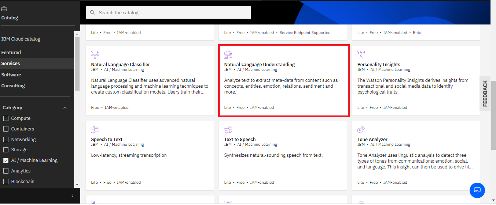
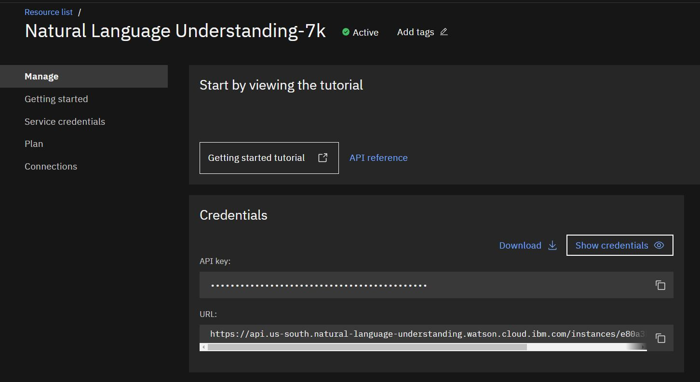
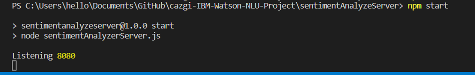
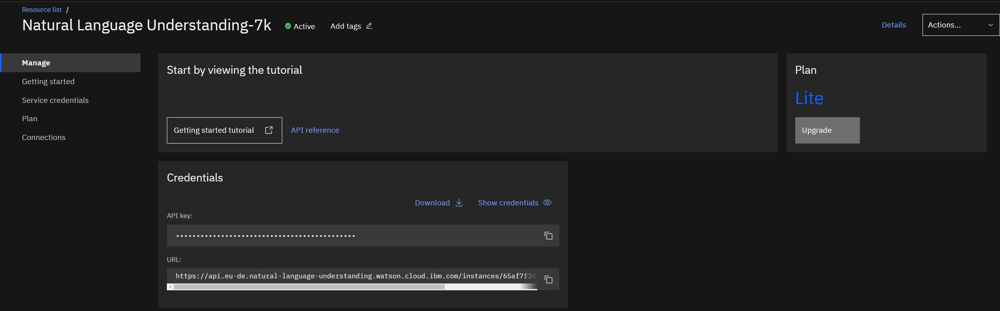

# IBM Watson Natural Language Understanding Analysis
This is provide a simple dynamic web applications that can be deployed on IBM Cloud. For the NLU models. We will use the IBM Cloud functions from their AI/Machine Learning resources.

**Watson Natural Language Understanding** offers a suite of features for text analysis. The Watson Natural Language Understanding analyze text to extract metadata from content such as concepts, entities, keywords, categories, sentiment, emotion, relations, and semantic roles using natural language understanding.

## Pre-requisites: Sign up for IBM Cloud account and create a Watson Natural language Understanding service
1. Create an IBM cloud account if you don't have one already.

2. Create an instance of Natural Language Understanding service.
Log into you IBM cloud account with your credentials. Go to the [Catalog](https://cloud.ibm.com/catalog?utm_medium=Exinfluencer&utm_source=Exinfluencer&utm_content=000026UJ&utm_term=10006555&utm_id=NA-SkillsNetwork-wwwcourseraorg-SkillsNetworkCoursesIBMDeveloperSkillsNetworkCD0220ENSkillsNetwork20363180-2022-01-01) page, click on the **Services** , select the **AI/ Machine learning** category and then select the **Natural Language Understanding** resource.
<p align="center">
  
</p>    

On the **Natural Language Understanding** page, select **DALLAS** as the Region, verify that the **Lite** plan is selected, and then click **Create**. You can keep the default name if you want.
<p align="center">
  
</p>    

## Deployment
### Fork the Git repository to have the server and client code you need to start
<details><summary><b>Show instructions</b></summary>

1. Create a fork of this [repository](https://github.com/Vykp00/Natural-Language-Understanding--IBM-Watson) into your own. Clone the repository by pasting the url you copied from the git repository:
```sh
  git clone https://github.com/Vykp00/Natural-Language-Understanding--IBM-Watson.git
```
2. Update the npm version:

```sh
npm install npm@latest -s
``` 
</details>

### Install Server-side packages

<details><summary><b>Show instructions</b></summary>

1. Change to the server `./sentimentAnalyzeServer`directory

2. All packages are needed to be installed are listed in `package.json`. Run `npm install -s`, to install and save those packages:

```json
  "dependencies": {
    "cors": "^2.8.5",
    "dotenv": "^10.0.0",
    "express": "^4.17.1",
    "ibm-watson": "^6.1.1"
  },
  "devDependencies": {
    "nodemon": "^2.0.12"
  },
  "engines": {
    "node": "16.15.1",
    "npm": "7.20.0"
  }
```
3. Test run the server:

```sh
npm start
```
If all the required packages are successfully installed, the server should start without any issues. Press Ctrl+C to stop the server.
<p align="center">
  
</p>  

</details>

### Install Install IBM Watson package and set up the .env file

<details><summary><b>Show instructions</b></summary>

1. Install the ibm-watson package in your server side using the following command:
```sh
npm install  -s ibm-watson@6.1.1

```

2. In the `.env` file. Paste the credentials to point to your Watson NLU credentials from the IBM cloud.
<p align="center">
  
</p>  

The contents of the `.env` file would be as below:

```sh

  API_KEY = <YOUR API KEY FROM IBM CLOUD>
  API_URL = <YOUR URL KEY FROM IBM CLOUD>

```

3. Install `dotenv` to `.env` file:

```sh
npm install  -s dotenv@10.0.0

```

</details>

### Create endpoints
Observe that the server code intends to provide 4 end-points.
* `/url/emotion` end-point is used to analyze the **emotion** using NLU, for a given url
* `/url/sentiment` end-point is used to analyze the **sentiment** using NLU, for a given url.
* `/text/emotion` end-point is used to analyze the **emotion** using NLU, for a given text.
* `/text/sentiment` end-point is used to analyze the **sentiment** using NLU, for a given text.

### React Client Side
<details><summary><b>Show instructions</b></summary>  

1. Change to client directory `sentimentAnalyzeClient`.

2. All packages are needed to be installed are listed in `package.json`. To install and save those packages, run the following command in the terminal.

```sh
npm install -s
```

3. :bulb: (Optional) Config client code display
* Open the client code `./sentimentAnalyzeClient/src/App.js` in the explorer

* Make changes to change the color of the sentiment response to your prefered color. The default color is green if the sentiment is positive, yellow if the sentiment is neutral and red if the sentiment is negative.

* Make changes in the `/sentimentAnalyzeClient/src/EmotionTable.js` to use `map` function that we used in the to render the EmotionTable component as a below.

```javascript
Object.entries(this.props.emotions).map(function(mapentry) {
return (
    <tr>
    <td>{mapentry[0]}</td>
    <td>{mapentry[1]}</td>
    <td>{mapentry[2]}</td>
    <td>{mapentry[3]}</td>
    </tr>
)
})
```
4. Run `npm run-script build`. Please note this is customized in package.json to generate and copy the client code to the server.

5. Change to the server side `sentimentAnalyzeServer`.

6. Run the server. This will start on port `8080`:

```sh
npm start
```

</details>